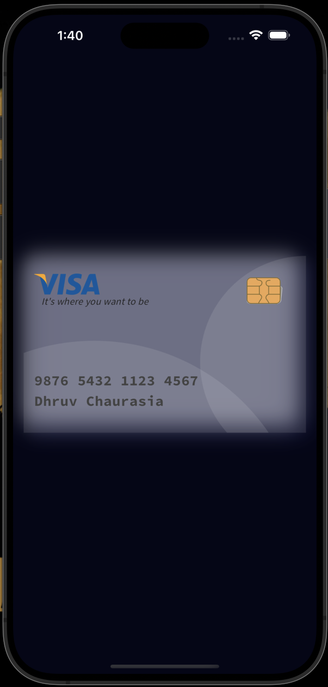

# Visa Card UI App

A Flutter application that showcases a beautifully designed Visa card UI.

## Table of Contents

- [Overview](#overview)
- [Features](#features)
- [Installation](#installation)
- [Usage](#usage)
- [Project Structure](#project-structure)
- [Screenshots](#screenshots)
- [Dependencies](#dependencies)
- [Contributing](#contributing)
- [License](#license)

## Overview

This application is a demonstration of a Visa card UI built using Flutter. It presents a modern and aesthetically pleasing design that simulates a credit card interface. The app utilizes Visa's brand colors and incorporates custom text styles to enhance the visual appeal.

## Features

- Elegant Visa card UI design
- Utilizes Visa's brand colors
- Responsive layout that adjusts to various screen sizes
- Custom fonts for improved readability
- Simple and clean code structure, making it easy to extend and modify

## Installation

1. **Clone the repository:**

    ```sh
    git clone https://github.com/DhruvChaurasia9403/visa-card-ui.git
    ```

2. **Navigate to the project directory:**

    ```sh
    cd visa-card-ui
    ```

3. **Install dependencies:**

    ```sh
    flutter pub get
    ```

4. **Run the app:**

    ```sh
    flutter run
    ```

## Usage

After installation, run the app on your preferred device or emulator to see the Visa card UI in action. You can modify the UI elements such as card number, name, and colors as per your requirements.

## Project Structure


## Screenshots

Include screenshots of your app to provide users with a visual overview of the interface:



## Dependencies

- [flutter](https://flutter.dev)
- [google_fonts](https://pub.dev/packages/google_fonts)

## Contributing

Contributions are welcome! If you have suggestions or improvements, please fork the repository and create a pull request.

1. Fork the project
2. Create your feature branch (`git checkout -b feature/AmazingFeature`)
3. Commit your changes (`git commit -m 'Add some AmazingFeature'`)
4. Push to the branch (`git push origin feature/AmazingFeature`)
5. Open a pull request

## License

This project is licensed under the MIT License - see the [LICENSE](LICENSE) file for details.

